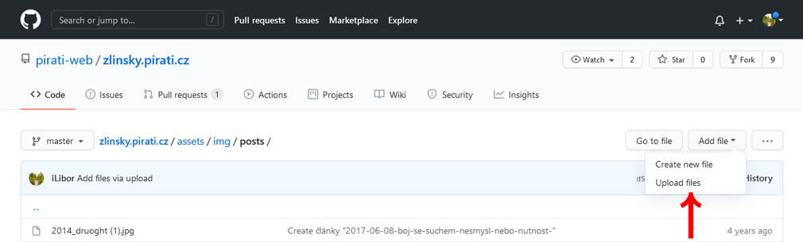
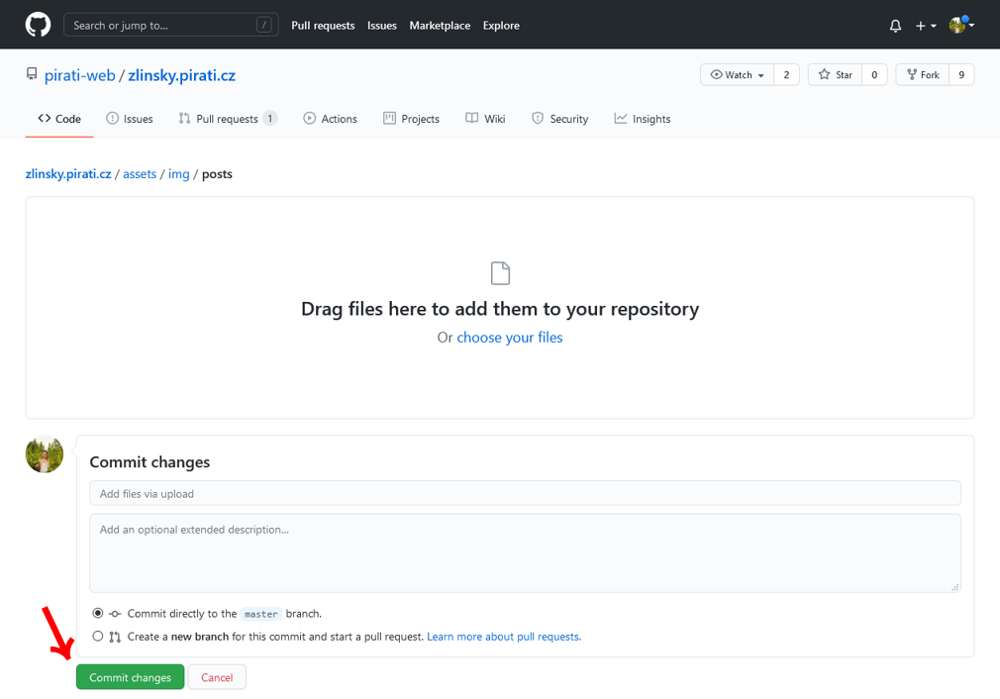
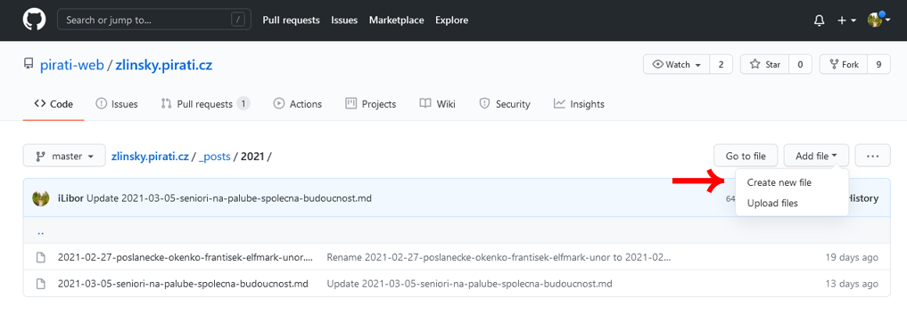
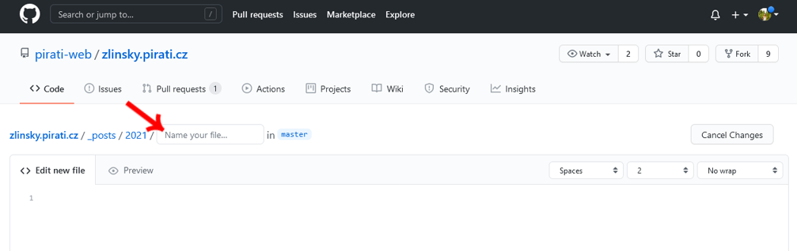
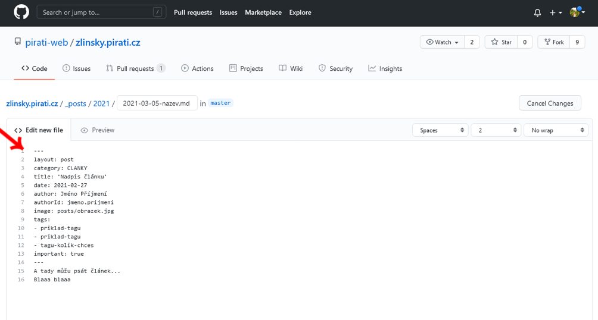
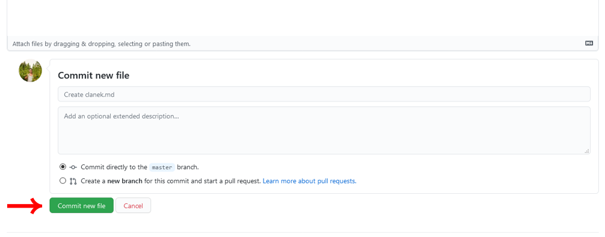
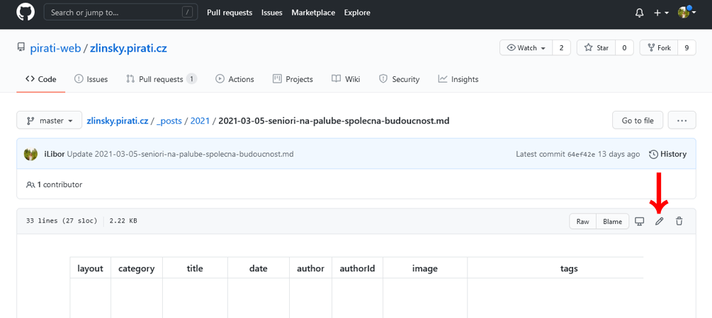

# Návod pro mediální spojku, aneb jak přidat článek

## Obrázek

1. U článku musí být vždy obrázek, optimální poměr stran je **16:9**, **rozměr 1200 x 675 px**.<br>
 Nedávat nekomprimované obrázky přes 300kB, sice se zobrazí, ale zbytečně to bere lidem data při prohlížení a zdržuje 
 to načítání stránek. <br>
 Fotky dávat ve formátu **.jpg**, infografiky ve formátu **.png** - grafika a písmo je pak trochu ostřejší.<br>
 Název obrázku bez interpunkce, všechno malým, více slov oddělovat pomlčkou např. nasi-zastupitele.jpg
2. Bez obrázku se článek nezobrazí, tak je nutné ho nejprve nahrát do adresáře **assets/img/posts**<br>
 V adresáři **posts** skoro vpravo nahoře zvolít **Add file** a **Upload file**, 
 objeví se dialog **Drag files here..** a tam obrázek/obrázky myší přesunout.
 
 
 
3. Pro nahrání je potřeba zvolit skoro vlevo dole **Commit changes** (zaškrtlé je Commit directly to master branch) 
 
 


## Nový článek

1. Články se nacházejí v adresáři **_posts** v příslušném podadresáři roku např. **_posts/2021**
2. V příslušném podadresáří skoro nahoře vpravo zvolit **Add file** a **Create new file**



3. Do kolonky **Name your file** napsat název souboru článku.<br> 
 Název píšeme vždy ve tvaru **rok-mesic-den-nazev-clanku.md** např. **2021-03-20-piratsky-sraz-probehl-dobre.md**<br>
 Název vždy malým písmem bez interpunkce, nezapomenout dát koncovku .md



4. Do pole článku vložit úvodní kód viz.
```
---
layout: post
category: CLANKY
title: 'Nadpis článku'
date: 2021-02-27
author: Jméno Příjmení
authorId: jmeno.prijmeni
image: posts/obrazek.jpg
tags: 
- priklad-tagu
- priklad-tagu
- tagu-kolik-chces
important: true
---
```



5. V tom kódu je pak nutné opravit:
- title - nadpis článku rozumné délky, nechat ho v těch jednoduchých uvozovkách
- date - datum kdy má vyjít článek, pokud dám pozdější než aktuální, tak se pak nedivím, že ho nevidím
- author - jméno autora
- authorId - ID autora, většinou jmeno.prijmeni
- image - název obrázku i s podadresářem post např. posts/obrazek.jpg
- tags - přidat tagy 
- important: true - znamená, že bude článek zvýrazněn černě, pokud vymažu, tak bude článek bez zvýraznění

   V kodu je nutné dodržet formátování i mezery tak jak jsou, jinak ten článek se nevytvoří.

6. Pod úvodní kod je možné psát text článku. Z první části textu se pak automaticky vytvoří perex, tak je dobré s tím počítat. 

7. Text se stylizuje za pomoci markdownu formátovaní, návod viz [zde](https://github.com/adam-p/markdown-here/wiki/Markdown-Cheatsheet).<br>
 Nebo krátký tahák.
```
# Nadpis
## Menší nadpis
*kurzíva* **tučné písmo** ~~škrtance~~ `kód`
* seznam nečíslovaný
1. seznam číslovaný
[název odkazu](http://www.pirati.cz)
[název odkazu](https://zlinsky.pirati.cz/assets/img/posts/nejaky-dokument.pdf)

> Blockquotes
```

8. Po napsání článku, lze základní náhled formátování získat kliknutím na Prewiew (skoro nahoře, mírně vlevo)

9. Hotový článek uložit a poslat k buildování tlačítkem **Commit new file** (zaškrtlé je Commit directly to master branch)




## Oprava článku

1. Články se nacházejí v adresáři **_posts** v příslušném podadresáři roku např. **_posts/2021**
2. V podadresáři kliknout na název článku a pak lehhce nahoře vlevo zvolit ikonu pera, pro zpřístupnění úprav.



3. Hotový článek uložit a poslat k buildování tlačítkem **Commit changes** (zaškrtlé je Commit directly to master branch)


## Článek se mi nezobrazuje, co teď?

1. Napřed čekat. Buildovaní článku někdy trvá i 10 minut. 
2. Zkontrolovat, jestli je dobře napsaná adresa obrázku.
3. Zkontrolovat jestli je v úvodním kodu dnešní datum, jinak se mi zobrazí až k datu, které tam je.
4. Zkontrolovat celý úvodní kód jestli v něm není proti vzoru vymazaná nebo přidaná nějaká mezera apod.
5. Má soubor článku koncovku .md ?
6. A až po úvodních 5 bodech kontaktovat TO.

<br><br>


# Další poznámky od jiných

## Obsah

- [pardubicky.pirati.cz](#pardubickypiraticz)
  - [Obsah](#obsah)
  - [Úvod](#Úvod)
  - [Lokální spuštění](#lokální-spuštění)
    - [Linux](#linux)
    - [Docker](#docker)
  - [Souborová struktura](#souborová-struktura)
    - [Pomocné soubory](#pomocné-soubory)
    - [Data](#data)
    - [Webové stránky](#webové-stránky)
  - [Jednoduchá změna pomocí GitHub](#jednoduchá-změna-pomocí-github)
    - [Registrace na Githubu](#registrace-na-githubu)
    - [Drobná změna](#drobná-změna)
    - [Přidání textového souboru](#přidání-textového-souboru)
    - [Přidání fotky](#přidání-fotky)
    - [Schválení změny](#schválení-změny)
    - [Kontrola](#kontrola)
  - [Složitější změny](#složitější-změny)
  - [Vytvoření regionálního webu](#vytvoření-regionálního-webu)
    - [Titulní obrázek](#titulní-obrázek)
    - [Kontaky na PiCe](#kontaky-na-pice)
    - [Více kandidátek](#více-kandidátek)
    - [Kalendář](#kalendář)
  - [Zobrazení mapky návrhů](#zobrazení-mapky-návrhů)
  - [Otestování buildu](#otestování-buildu)
  - [Získání pomoci](#získání-pomoci)

## Úvod

Pirátská strana má své weby pro veřejnost statické a umístěné na vlastním serveru.

Samotné texty a data jsou umístěné v GIT repozitářích jako je tento. Repozitář je taková
chytrá složka souborů. Chytrá je v tom, že si pamatuje veškerou historii umožňuje více
lidem pracovat zároveň a slučovat jejich práci.

Repozitáře si můžete stáhnout (clone) na svůj počítač nebo k němu přistupovat pomocí githubu.
Z githubu se repozitář stahuje na naše servery.

Když dojde ke změně dat tak se na naších serverech repozitář zkompiluje. K tomu se používá Jekyll,
ten vezme soubory z aktulání verze repozitáře, přidá k nim soubory z
[jekyll-theme-pirati](https://github.com/pirati-web/jekyll-theme-pirati) a vyrobí z nich samotné
html & css, které pak čte webový prohlížeč.

## Lokální spuštění

### Linux

Instalace na Fedora 25:
```
sudo dnf group install "C Development Tools and Libraries"
sudo dnf install ruby-devel
sudo dnf install rubygem-jekyll
```

Instalace Ubuntu 16.04:

```
sudo apt-get install ruby-dev gcc make libghc-zlib-dev
gem install rubygems-update
gem install jekyll bundler
bundle
```

Repozitář můžeme naklonovat do jakékoliv složky (nemusí být ve `/var/www/`).

Po stažení nové verze může být potřeba:
`bundle install --path vendor/bundle`

Spustění je pomocí
`jekyll serve --watch --livereload`, což stránku zkompiluje, spustí a ještě je stránka přístupná skrz localhost: `http://127.0.0.1:4000`

Popřípadě můžeme spustit jen: `jekyll build`, což do složky `_site` připraví kompletní web (ten můžeme otevřít z prohlíže pomocí klavesové zkratky `ctrl+o`).

### Docker

instalujte docker podle návodu na váš operační systém (anglicky)

* [Windows](https://docs.docker.com/docker-for-windows/install/)
* [macOS](https://docs.docker.com/docker-for-mac/install/)
* [Ubuntu](https://docs.docker.com/install/linux/docker-ce/ubuntu/)
* [Fedora](https://docs.docker.com/install/linux/docker-ce/fedora/)

a ověřte že máte `docker-compose` [official resources](https://docs.docker.com/compose/install/) a spušteného demona.
Pak stačí:
```
docker-compose up
```
Za vylepšení tohoto návodu budeme rádi.

## Souborová struktura

### Pomocné soubory

* `Gemfile` se soubor "knihoven" které potřebuje Jekyll, nastavit v něm můžete např verzi thema které použijete. `Gemfile.lock` je pomocný soubor pro stejnou věc.
* `_config.yml` slouží jako hlavní návod pro Jekyll jak překládat, vyplňuji se v něm důležité texty a odkazy a taky nastavují některé parametry thema
* `Dockerfile` a `docker-compose.yml` slouží k lokálnímu spuštění webu.
* `README.md` je tento text.
* `_site` a `vendor` jsou složky viditelné jen při lokálním spuštení. V `_site` jsou výsledné html stránky. V `vendor` jsou uložené "knihovny".

### Data

* V `assets` budete použítat primárně složku `img` kam patří fotky a obrázky.
* `_posts`, `_people`, `_program` obsahují soubory s články, lidmi a programovými body. Soubory jsou vždy ve formátu markdown a na vrhchu mají `yml` hlavičku která je ohraničená `---`.
* Složka `_data` obsahuje soubory které jsou pouze tou hlavičkou. Kromě `yml` mohou obsahovat i `json`.  V `_data/menu.yml` se nastavují odkazy v horní liště, menu i na spodu stránky.

### Webové stránky

Samotné stránky jsou v markdownu nebo v html (složitější struktura, např. vícesloupců apod)
* `index.html` popisuje titulní stránky
* v dalších složkách jako je např `kontakt` nebo `lide` najdeme popis stránek, které budou na *example.pirati.cz/kontakt/* resp *example.pirati.cz/lide/* krom indexu tam lze přidávat další stránky pokud např v `komunalni-volby` přidáte soubor `harmonogram.md` ve správném formátu, tak vyrobíte stránku *example.pirati.cz/komunalni-volby/harmonogram.html*
* obrázek se do stránky (i v markdown formátu) vkládá pomocí kódu `````` přičemž obrázek *assets/img/posts/jmeno_obrazku.jpg* musí existovat; kromě parametru *alt* je možné použít parametr magick pro úpravu obrázku, např.: ```magick:resize='200x'```, kompletní dokumentace je k dispozici [zde](https://github.com/envygeeks/jekyll-assets)

## Jednoduchá změna pomocí GitHub

Rozlišujeme dva typy uživatelů.
Prvními jsou lidé pouze zaregistrovaný na githubu může navrhnout změnu kdekoliv.
Druhými jsou správci (collaborants) ti můžou rovnou přispívat a schvalovat změny.

Pro jednoduché weby doporučujeme mít pouze dva správce,
jednoho 'editora' který na web dáva články informace a na začátku ho plnil a druhého
technicky zdatného, který řeší problémy a dělat velké změny. Ostatní přispěvatelé
mohou navrhovat změny.

### Registrace na Githubu

Registrujte se [tady](https://github.com/join?source=header-home)
jako username doporučuji zvolit reálné jméno a přidat i fotku. Usnadníte tím práci editorům a celkovou spolupráci pirátu na webech.

### Drobná změna

Jako je např. oprava gramatické chyby nebo přidání telefoního čísla.

Najděte si daný soubor. Vpravo nahoře obsahu toho souboru je symbol tužky. Kliknětě a navrhněte změny. Pokud není naprosto jasné co děláte tak do commit message dole připište zdůvodnění. Dejte navrhnout úpravy a pak schválit merge request. Tj. je třeba kliknout dvakrát.

Existuje ještě elegantní trik jak se dostat k editaci: přímo na samotném webu najít vpravo dole tlačítko navrhnout změnu.

### Přidání textového souboru

Na githubu najeďte do složky, kam chcete soubor přidat, a klidněte na "create new file". Doporučuji si zároveň otevřít jiný soubor z dané složky, ať z něj můžete zkopírovat strukturu a vyměnit jenom data.

### Přidání fotky

Fotky může přidávat pouze 'editor'. Fotky přidávejte v dostatečném rozlišení
(lepší větší než menší). Web si fotky sám škáluje a ořezává podle toho, v jakém
formátu je zrovna na daném místě potřebuje.

Fotky osob je dobré dodávat ve čtvercovém formátu, protože jejich profilové
fotky, jsou vždycky čtvercové. Tím zamezíte nechtěným ořezům hlav lidí atp.

Pokud potřebujete použít stejnou funkcionalitu i na jiném místě ve vaší kopii webu,
mrkntěte na použítí
[tady](https://github.com/pirati-web/jekyll-theme-pirati/blob/master/_includes/people/profile-badge.html#L12)
a [tady](https://github.com/envygeeks/jekyll-assets).

### Schválení změny

Na hlavní stránce nahoře je pole "merge request" - tam se nachází seznam návrhů. Projděte si je, rozklikejte je a po kontrole můžete kliknout na "merge pull request" a následně "confirm merge".

### Kontrola

Pokud děláte změny takto přes github, může dojít k chybě, které si hned nevšimnete. Proto je po změně potřeba zkontrolovat, že se vše povedlo. Nicméně buťte trpěliví, může trvat až pět minut než se změna projeví. Existují tři typy chyb:

- První je, že se něco viditelně rozbije - například zmizí kus textu a vy vidíte jen "tel" a za tím nic
- Druhý je, že se něco rozbije natolik, že web ani nejde přeložit. V tom případě zůstane ve staré verzi a vy nevidíte žádnou změnu.
- Třetí a nejhorší je, že nahrajete něco, co byste na pirati.cz vůbec neměli nahrávat. Tomu zabráníte jedině tak, že pečlivě kontrolujete commity a nepustíte dál žadnou změnu, které nerozumíte.

To, že něco pokazíte se může stát každému. Důležité je nebát si říct o pomoc a chybu napravit.

## Složitější změny

Tento web používá [jekyll-pirati-theme](https://github.com/pirati-web/jekyll-theme-pirati). Cokoliv z něj jde přepsat. Používejte co nejnovějši verzi. Verze se nastavuje v `Gemfile` a je zmíněna i v `assets` části `_config.yml`.

Pokud chcete zasahovat do JS nebo CSS tak si přečtete [dokumentaci thema](https://github.com/pirati-web/jekyll-theme-pirati/blob/master/development.md)

## Vytvoření regionálního webu

Pokud byste tuto šablonu chtěli využít pro tvorbu webu svého místního sdružení, změňte následující:

- v souboru `_config.yml` změňte hodnoty v horní části (title, description, url) a odkazy pod tím
- v adresáři `_people` odstraňte naše lidi a místo toho založte vlastní
- v adresáři `assets/img/people` dejte fotky vašich lidí
- v adresáři `_posts` odstraňte vzorový blogový příspěvek a dejte vlastní
- v adresáři `assets/img/posts` odstraňte naše fotky pro blogové příspěvky a dávejte vlastní
- v souboru `kontakty/index.md` upravte doporučené kontakty, zároveň u jednoho člověka v people vyplňte `category` `kontaktni_osoba`
- v souboru `lide/index.html` upravte text a obsah stránky `O nas`

### Titulní obrázek

Přidejte široký webový a úzký mobilní obrázek a nastavte parametry v `_config.yml`

### Kontaky na PiCe

V `_config.yml` vyplně adresu PiCe a obrázek. Následně v `kontakty/index.html` nastavte `residence: yes`.

### Více kandidátek

To je trošku tricky nastavení, pro inspiraci se podívejte do `jekyll-theme-pirati`.

### Kalendář

Pro vložení kaledáře existují dvě cesty:

* **Jednoduchá**: prostě zkopírujte adresu kalendáře pro vložení do stránky,
  takto vložený kalendář je zcela funkční, ale nevypadá úplně pěkně
* **Složitější**: zahrnuje nutnost získat Google Calendar API klíč, výhodou
  ovšem je, že kalendář bude vizuálně sladěný se zbytkem webu

V případě jednoduché varianty potřebujete pouze adresu pro embeddování.
Naleznete ji v nastavení kalendáře na Google Calendar webu. Tuto hodnotu vplňte
v `_config.yml` do pole `calendar.page`.

Složitější postup není ve skutečnosti nikterak komplikovaný. Budete potřebovat
získat ID kalendáře (napište ho do `calendar.id`), které je také k dispozici na
Google Calendar webu. Následně ještě budete potřebovat Google Calendar API key a
domluvit se se správcem webu aby vám ho zapnul.

API klíč získáte v [Google Developer
Consoli](https://console.developers.google.com). Nejprve si vytvořte nový
projekt (třeba example.pirati.cz). Poté je nutné přes "Enable APIs and services"
povolit pro projekt `Google Calendar API`. Poté si vytvořte samotný API klíč. To
provedete tak, že kliknete na "Create credentials" v sekci
[Credentials](https://console.developers.google.com/apis/credentials). Jako typ
vyberete "API key" a výsledkem bude změť písmen a znaků, které tvoří samotný
klíč. Je vhodné pomocí "Restrict key" omezit adresy, na kterých klíč může být
používán, aby vám ho někdo neukradnul. V "Application restrictions" vyberte
"HTTP referers" a vyplňte všechny adresy, na kterých web chcete provozovat
(např. `https://example.pirati.cz`, vždy jedna na řádek). Pokud chcete udělat
klíč pro lokální vývoj (např. `http://localhost:4000`), doporučujeme si na to
udělat samostatný klíč a ten nikomu neukazovat aby se  předešlo zneužití (protože
`localhost` vlastní každý).

Mějte na paměti, že s klíčem máte právo kromě čtení také věci editovat.

Jakmile máte platný klíč, tento klíč předejte správci, který s vámi řeší uvedení
webu do provozu. Řekněte mu, že potřebujete nastavit tzv. environment variable
`GOOGLE_CALENDAR_APIKEY` na hodnotu klíče, kterou jste předtím získali v
Developer Consoli. Poté bude váš kalendář vypadat jako např. na [pardubickém
webu](https://pardubice.pirati.cz).

## Zobrazení mapky návrhů

Implementace mapky návrhů byla ve verzi 6.1.0 jekyll-theme-piráti upravena,
nyní je mapový podklad řešen přes službu [Mapbox](https://www.mapbox.com/).

Abyste mapičku zobrazili, je nutné si tam vytvořit účet a následně získáte
*access token*. Ten pak při spuštění stránek poskytnete pomocí environment
variable `MAPBOX_ACCESS_TOKEN`. Následně můžete do kterékoliv stránky
přidat kód podobný tomuto:

```

  <div class="__vue-root" data-app="IntentionMap" data-accesstoken="{{ site.env.MAPBOX_ACCESS_TOKEN }}" data-dataset="https://gist.githubusercontent.com/xaralis/f9711e5d12f971504d0753ba40c3d33e/raw/4a1701c64de5eb7ed6aa1538cb269022965d82d6/map.geojson" data-ideaform="https://goo.gl/forms/wKSPmWNDzgRiUxLN2"></div>

```

Jak je vidět, potřebujete nějaký geojson soubor, který definuje jednotlivé položky
na mapě. Pro vytvoření mapového podkladu můžete využít libovolný GeoJSON
editor, např. `http://geojson.io`. Aby mapa záměrů správně fungovala,
měly by jednotlivé položky mapy mít následující atributy:

* `id` - jedinečný identifikátor záměru, celé číslo
* `name` - definuje jméno záměru na mapě
* `category` - definuje kategorii záměru
* `description` - definuje detailní popis záměru
* `image` (volitelné) - URL obrázku záměru

Pomocí atributu `data-ideaform` lze volitelně připojit i link na formulář, kam vám
veřejnost může zasílat své nápady.

## Otestování buildu

Pokud chcete otestovat, jaké stránky se vám při nasazení vygenerují, spusťte
následující příkaz:

```
JEKYLL_ENV=production bundle exec jekyll build
```

Výsledné stránky jsou uloženy v adresáři `_site`. Je vhodné následně ještě
spustit [html-proofer](https://github.com/gjtorikian/html-proofer) pro ověření,
že všechny odkazy, které na webu máte, někam vedou:

```
bundle exec htmlproofer --assume-extension --disable-external --url-ignore "#,#fn:1" ./_site
```

Pokud tento příkaz selže, znamená to, že jste nejspíš někde uvedli špatnou adresu.

Můžete také využít příkaz `build.sh`, který obsahuje oba výše zmíněné příkazy:

```
./build.sh
```

## Získání pomoci

Projděte si [návod na git](http://www.kutac.cz/blog/pocitace-a-internety/git-tutorialy-a-navody/) nebo
[knížku v čestine](https://www.root.cz/knihy/pro-git/)

Jekyll má velmi podrobnou [dokumentaci](http://jekyllrb.com/docs/home/). A při vývoji též doporučuji [cheat sheet](http://jekyll.tips/jekyll-cheat-sheet/)

Example web používá [jekyll-pirati-theme](https://github.com/pirati-web/jekyll-theme-pirati). Cokoliv z něj jde přepsat. Používejte co nejnovějši verzi.

Technicky přesné dotazy můžete směřovat na TODO-issue-theme nebo [redmine](https://redmine.pirati.cz/projects/to/issues/new)

Na cokoliv se zeptejte třeba na [chatu](https://chat.pirati.cz/channel/tech-weby)

Ptejte se lidí okolo vás, kteří danou věc dělali, TO a dalších. Jak říkala moje prababička "Líná huba, holé neštěstí".

# Pirátský web Stredočeského kraje - stredocesky.pirati.cz

* pokud je to možné, je lepší použít Markdown (.md) formát než html
* pokud kód nemůžete otestovat na lokále (stažení celého repa, build a spuštění v jekyllu), dělejte jen drobné změny, kterým rozumíte
* obecně k pirátským šablonám: https://github.com/pirati-web/jekyll-theme-pirati/blob/master/USAGE.md
* další repository pro inspiraci: https://github.com/pirati-web
* web je dostupný i přes hostname stc.pirati.cz včetně všech URL, např. stc.pirati.cz/volby

# Co má nebo musí mít článek

* jméno článku rozumné délky
* autora
* datum (pokud nemá být aktuální)
* titulní fotografii (zobrazuje se v seznamu článků a také v samotném článku nahoře - bez dalšího popisu)
* tagy
* první část textu vhodnou pro automaticky generovaný perex
* text co nejméně formátovaný, bez obtékání obrázků

Článek také může obsahovat:

* více obrázků
* citace v samostatném odstavci s uvozovkama + uvozením autora (před nebo poté)
* dlouhé URL odkazy v seznamu dalších zdrojů je třeba opatřit jednoznačným jménem/popisem (např. iDnes: K Jirkovi se vrátit nechci, říká Andrea Pomeje)

Obrázky pro články by měly být zmenšené do 800px, s jpeg kvalitou 95% a velikostí souboru do 300KB.

# Co má nebo musí mít osobní profilová stránka

* jméno a příjmení, tituly
* u piráta uživatelské uid
* kontakt (minimálně pirátský e-mail), případně linky na osobní weby atd.
* fotka (hlava) - ořezává se do čtverce a nechává se v co nejvyšším rozlišení
* historie vč. data a místa narození, profese a záliby

# Markdown formát

```
# Nadpis
## Menší nadpis
*kurzíva* **tučné písmo** ~~škrtance~~ `kód`
* seznam nečíslovaný
1. seznam číslovaný
[odkaz](http://www.pirati.cz)
obrazek: 
```

Jak správně citovat:

```
> „Tohle říkám."
říká Petr Novák.
```

Více viz https://en.wikipedia.org/wiki/Markdown nebo https://github.com/adam-p/markdown-here/wiki/Markdown-Cheatsheet

# Jednoduchá editace souborů přímo na githubu

Pro editaci stačí mít github účet, nejsou potřeba žádná speciální práva. Postup je následující:

Pro jednoduché editace je možné použít odkazy "Navrhni úpravu" vpravo dole na každé stránce webu. Odkaz vás přesměruje na přímo na editaci na githugu.
Nebo po rozkliknutí konkrétního souboru na githubu lze kliknout na ikonu tužky v pravém horním rohu (po najetí myší se objeví hláška: "Edit the file in your fork of this project").

1. Změňte potřebné části souboru (nahoře na liště mód "Edit file"),
2. zkontrolujte správnost provedených změn kliknutím na "Preview changes" na horní liště (červeně jsou označeny odebrané části textu, zeleně naopak ty přidané),
3. sjeďte na konec stránky k tabulce "Propose file change" a vyplňte pole "Add an optional extended description..." - stručně a jasně shrňte své změny,
4. klikněte na zelené tlačítko "Propose file change",
5. objeví se nová stránka, kde ještě jednou uvidíte provedené změny a pokud je vše v pořádku, klikněte na horní zelené tlačítko "Create pull request" a pak ještě jednou na další stránce,
6. počkejte, až vaše změny potvdí administrátor stránek (přijde vám do e-mailu zpráva, když se tak stane),
7. a máte HOTOVO!


# Pro linuxáky

Vystačíte si s jakýmkoliv editorem a "git" klientem (balík by se měl jmenovat stejně). Pár tipů pro command line git klienta viz níže - i tak byste ale měli vědět, co v každém kroku děláte!

Více viz https://help.github.com/


## Start

```
mkdir ~/git
cd ~/git
git clone https://github.com/pirati-web/stredocesky.pirati.cz
git config user.name "vas_github_user"
git config --global credential.helper cache
git config --global credential.helper 'cache --timeout=3600'
```

## Zápis změn do lokálního repository a přenos na server

```
git status
git add -A
git commit -a
git push
```

## Aktualizace lokálního repository

To udělejte vždy, než něco začnete měnit.

```
git fetch
```

## Upgrade témátka

1. zjistit [poslední release](https://github.com/pirati-web/jekyll-theme-pirati/releases) a projít changelog
2. nahradit verzi v Gemfile (jekyll-theme-pirati)
3. nahradit verzi v _config.yml (vendor/bundle/ruby/2.5.0/gems/jekyll-theme-pirati-...)
4. spustit *bundle install*
5. otestovat lokální build

## CODE HOWTO - vložení upoutávky článku
```


```

## CODE HOWTO - vložení medailonku člověka
```


```

## CODE HOWTO - redirect

Na stránce máme aktivní modul jekyll-redirect-from. Do hlavičky md stránky je tak možné např. přidat:

```
redirect_from:
  - /zdrojovaURL
```

